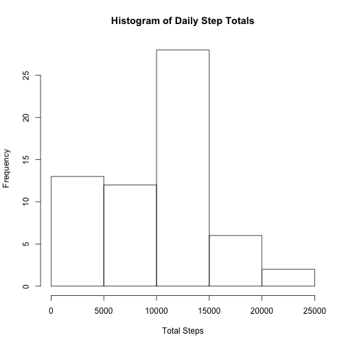
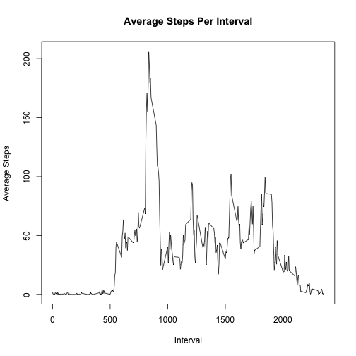
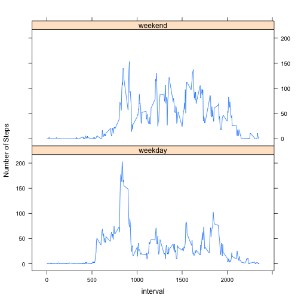

## Loading Libraries

dplyr package is used in user for data manipulation
lattice packake is used for the panel plot in the last part


```r
library(dplyr)
```

```
## Warning: package 'dplyr' was built under R version 3.1.2
```

```
## 
## Attaching package: 'dplyr'
## 
## The following object is masked from 'package:stats':
## 
##     filter
## 
## The following objects are masked from 'package:base':
## 
##     intersect, setdiff, setequal, union
```

```r
library(lattice)
```

## Loading and preprocessing the data
The data for this assignment can be downloaded from the course web site:  
Dataset: [Activity monitoring data (52K)](https://d396qusza40orc.cloudfront.net/repdata%2Fdata%2Factivity.zip)  

The variables included in this dataset are:
- steps: Number of steps taking in a 5-minute interval (missing values are coded as NA)
- date: The date on which the measurement was taken in YYYY-MM-DD format
- interval: Identifier for the 5-minute interval in which measurement was taken

The dataset is stored in a comma-separated-value (CSV) file and there are a total of 17,568 observations in this dataset.

```r
data<-read.csv("activity.csv")
```


## What is mean total number of steps taken per day?
### Calculate the total number of steps taken per day

```r
grouped_by_date<-group_by(data, date)
day_totals<-summarize(grouped_by_date, steps=sum(steps, na.rm=TRUE) )
print(day_totals)
```

```
## Source: local data frame [61 x 2]
## 
##          date steps
## 1  2012-10-01     0
## 2  2012-10-02   126
## 3  2012-10-03 11352
## 4  2012-10-04 12116
## 5  2012-10-05 13294
## 6  2012-10-06 15420
## 7  2012-10-07 11015
## 8  2012-10-08     0
## 9  2012-10-09 12811
## 10 2012-10-10  9900
## ..        ...   ...
```
### Make a histogram of the total number of steps taken each day

```r
hist(day_totals$steps, main="Histogram of Daily Step Totals", xlab="Total Steps")
```

 
### Calculate and report the mean and median of the total number of steps taken per day

```r
summarize(day_totals, mean=mean(steps, na.rm=TRUE), median=median(steps, na.rm=TRUE))
```

```
## Source: local data frame [1 x 2]
## 
##      mean median
## 1 9354.23  10395
```


## What is the average daily activity pattern?
### Make a time series plot (i.e. type = "l") of the 5-minute interval (x-axis) and the average number of steps taken, averaged across all days (y-axis)

```r
grouped_by_interval<-group_by(data, interval)
interval_means<-summarize(grouped_by_interval, interval_mean=mean(steps, na.rm=TRUE) )
plot(interval_means$interval, interval_means$interval_mean, type="l", xlab="Interval", ylab="Average Steps", main="Average Steps Per Interval")
```

 

### Which 5-minute interval, on average across all the days in the dataset, contains the maximum number of steps?


```r
#The interval with the highest average can be determined by sorting the average in descending order and inspecting the first row
sorted_desc<-arrange(interval_means, desc(interval_mean))
sorted_desc[1,]
```

```
## Source: local data frame [1 x 2]
## 
##   interval interval_mean
## 1      835      206.1698
```


## Imputing missing values
### Calculate and report the total number of missing values in the dataset (i.e. the total number of rows with NAs)

```r
#number of missing values
sum(is.na(data$steps))
```

```
## [1] 2304
```

### Devise a strategy for filling in all of the missing values in the dataset. 
The strategy chosen in this case is to set the missing values to 0.  The rationale here is that the measure is easily "baselined" at 0. The default state for a human is rest, and therefore taking 0 steps.

### Create a new dataset that is equal to the original dataset but with the missing data filled in.

```r
data2<-data
data2$steps[is.na(data$steps)]<-0
```

### Make a histogram of the total number of steps taken each day

```r
grouped_by_date2<-group_by(data2, date)
day_totals2<-summarize(grouped_by_date2, steps=sum(steps, rm.NA=TRUE) )
hist(day_totals2$steps, main="Histogram of Daily Step Totals", xlab="Total Steps")
```

 

###  Calculate and report the mean and median total number of steps taken per day

```r
summarize(day_totals2, mean=mean(steps, na.rm=TRUE), median=median(steps, na.rm=TRUE))
```

```
## Source: local data frame [1 x 2]
## 
##      mean median
## 1 9355.23  10396
```
### Do these values differ from the estimates from the first part of the assignment? What is the impact of imputing missing data on the estimates of the total daily number of steps?

The values do differ.  They are lower.  Because the chosen method to input missing values was to baseline at 0, the added 0's bring down the averages.  However, the data already contained mostly 0's (humans sit a LOT), so it didn't move the averages significantly.

## Are there differences in activity patterns between weekdays and weekends?
### Create a new factor variable in the dataset with two levels – “weekday” and “weekend” indicating whether a given date is a weekday or weekend day.

```r
data2<-mutate(data2, day_type=factor(weekdays(as.POSIXlt(date)) %in% c("Saturday", "Sunday"), labels=c("weekday", "weekend")))
```

### Make a panel plot containing a time series plot (i.e. type = "l") of the 5-minute interval (x-axis) and the average number of steps taken, averaged across all weekday days or weekend days (y-axis)

```r
grouped<-group_by(data2, day_type, interval)
temp<-summarise_each(grouped, funs(mean))

xyplot(steps~interval|day_type, data=temp, type="l", layout=c(1,2), xlab="interval", ylab="Number of Steps")
```

 
